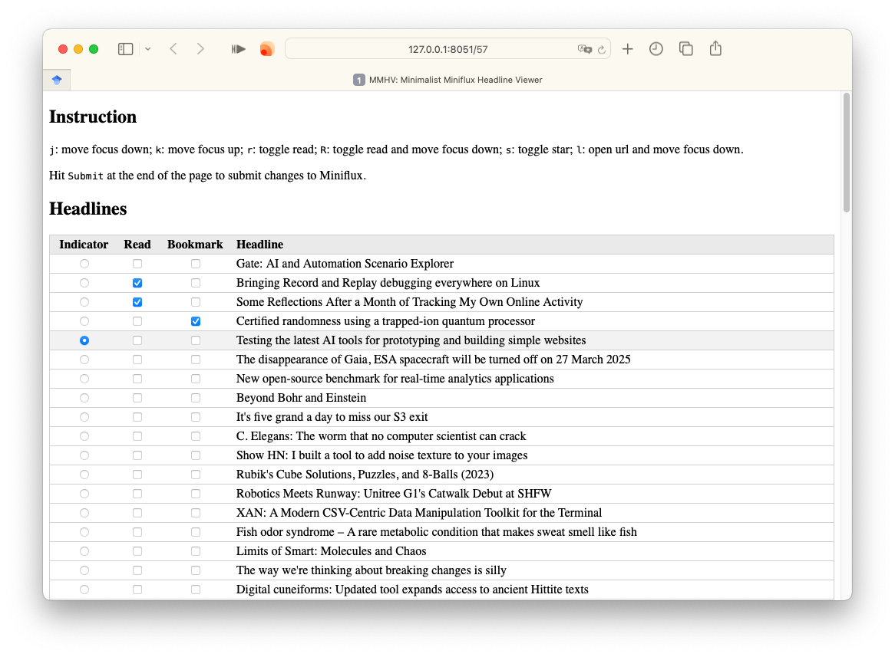

# MMHV: Minimalist Miniflux Headline Viewer

A very simple keyboard-oriented Miniflux frontend.



## Introduction

This is a third-party minimalist [Miniflux][miniflux] frontend developed with Python [FastAPI][fastapi].
The frontend features fluent skimming over tons of RSS headlines, making it suitable for RSS sources like Hacker News.

Features:

- Vim-like Keyboard shortcuts <a href="#feature-footnote">†</a>.
- RSS articles sorted in ascending publication time <a href="#feature-footnote">†</a>.

Non-features:

- No article body; headlines only.

<div id="feature-footnote">
†: <i>Might be made configurable in the future.</i>
</div>

[miniflux]: https://miniflux.app/index.html
[fastapi]: https://fastapi.tiangolo.com/

## Installation

### Choice 1: pipx or uvx

Install with [pipx][pipx]:

```bash
pipx install git+https://github.com/kkew3/mmhv.git
```

or [uv][uv]:

```bash
uv tool install git+https://github.com/kkew3/mmhv.git
```

Then run with

```bash
env \
    MINIFLUX_BASEURL=http://127.0.0.1:8050 \
    MINIFLUX_API_KEY=****** \
    MMHV_HOST=127.0.0.1 \
    MMHV_PORT=8051 \
    mmhv
```

[pipx]: https://pipx.pypa.io/stable/
[uv]: https://docs.astral.sh/uv/

### Choice 2: Clone this repository

```bash
# Clone to <CURRENT_WORKING_DIRECTORY>/mmhv.
git clone https://github.com/kkew3/mmhv.git && cd mmhv
# Create a virtual environment.
python3 -m venv venv && source venv/bin/activate
# Install this package.
pip install .
# Edit .env.example and save as .env .
vim .env.example
# Run the mmhv server.
test -f .env && mmhv
```

## Usage

Suppose that `mmhv` is served at `127.0.0.1:8051`, simply visit `127.0.0.1:8051/<feed_id>`.
